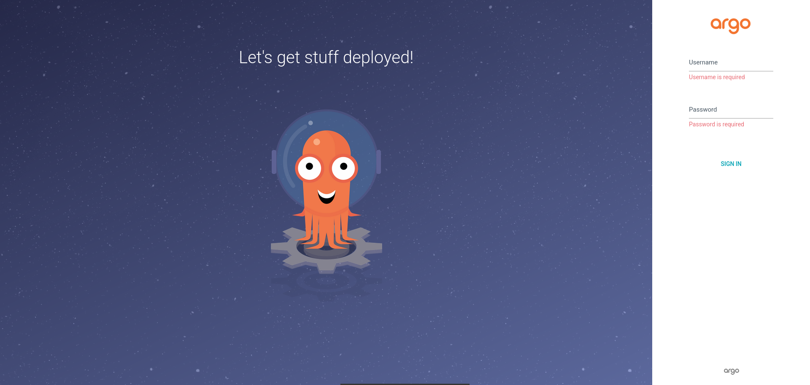
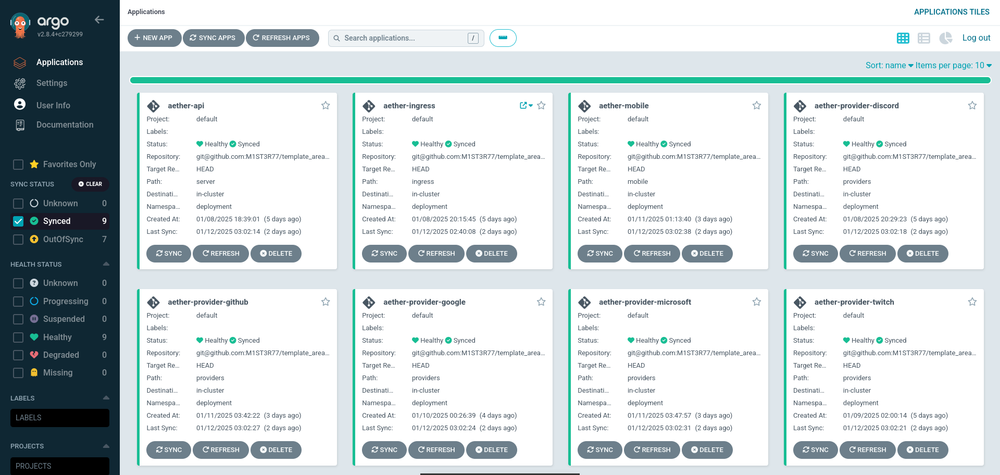

# Explanation Guide

Checkout different documentations :
- [Ansible](./ansible/index.md)
- [Templates](./templates/index.md)
- [Kubernetes](./kubernetes/index.md)

# Installation & Deployment

## Guide to setting up a Kubernetes cluster with Ansible

### Step 1: Install Ansible
Let's start by installing ansible on your machine.


```bash
sudo apt update
sudo apt install ansible -y
```

### Step 2: Start your virtual machine

1. **Create a virtual machine:**
    - A master machine

2. **Configure them to enable SSH connection with an RSA private key.**
    - RSA private key generation (if you don't already have one) :

         ```bash
         ssh-keygen -t rsa -b 4096 -f id_rsa
         ```
    - Copying public keys on virtual machines :

         ```bash
         ssh-copy-id -i id_rsa.pub <machine_user>@<machine_ip>
         ```

### Step 3: Connection configuration for Ansible

Create the file all.yml in the group_vars folder.

Typical structure of the group_vars/all.yml file :

```yaml
master_ip: 127.0.0.1
ansible_user_master: ubuntu
private_key_path_master: ./id_rsa
```

This command will install everything needed to create a Kubernetes cluster with :

- A master node

### Step 5: Check installation

1. **Connect to the master machine via SSH :**

    ```bash
    ssh -i <ssh_key_path> <machine_user>@<master_ip>
    ```

2. **Check the status of Kubernetes nodes:**

    ```bash
    kubectl get nodes
    ```

This guide is now complete, and you have successfully set up a kubernetes cluster.

## Guide to launch ArgoCD and deploy your project

### Step 1: Connection to ArgoCD interface





### Step 2: Create your apps and deploy them 

Now you can click on **New apps** and enter the information needed to launch your apps.
In our case, we're using Helm's templates to configure our apps.

For more information about Helm templates, please refer to this page:  [Templates Documentation](./templates/index.md)